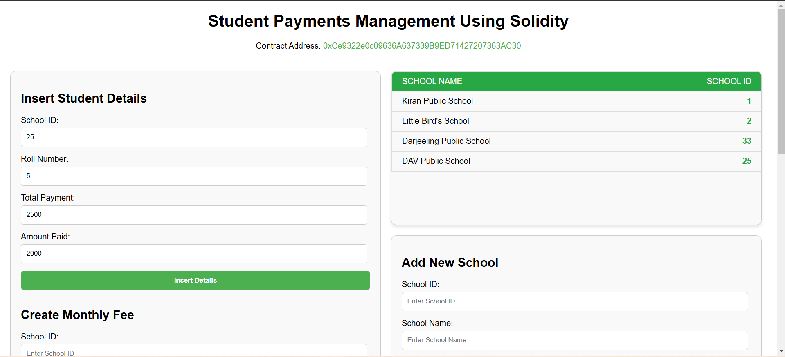

# 🎓 Student Payment Management System 

Welcome to the **Student Payment Management System**! This project showcases a decentralized application (DApp) for managing student records using a Solidity smart contract and a Web3-powered front-end.  

---

## 🚀 About the Project  

This DApp allows users to fetch student details securely by entering their **School ID** and **Roll Number** in specific formats. It's an easy-to-use, decentralized system built for transparency and efficiency.  

---

## 📋 How to Test  

Want to try it out? Follow the testing instructions below:  

### Example Inputs in get student details:  

| **School ID** | **Roll Numbers** |  
|---------------|------------------|  
| `25`          | `01`, `02`       |  
| `33`          | `01`             |  

---

## 💡 Key Features  

- Decentralized student record management.  
- Simple, clear input formats for easy access.  
- Smart contract-based operations for trust and security.

---

## 📝 Solidity Code 
Here's the core Solidity code that powers this system:  
[Explorer](https://sepolia.etherscan.io/address/0xCe9322e0c09636A637339B9ED71427207363AC30 "Visit all info")

---

(https://sepolia.etherscan.io/address/0xCe9322e0c09636A637339B9ED71427207363AC30)

> **Note:**  
> You can't see the **Add School** container because it is only visible to the contract owner. Only the owner can add schools.

